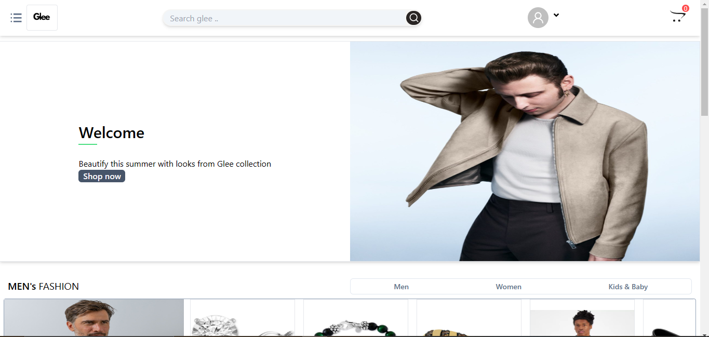
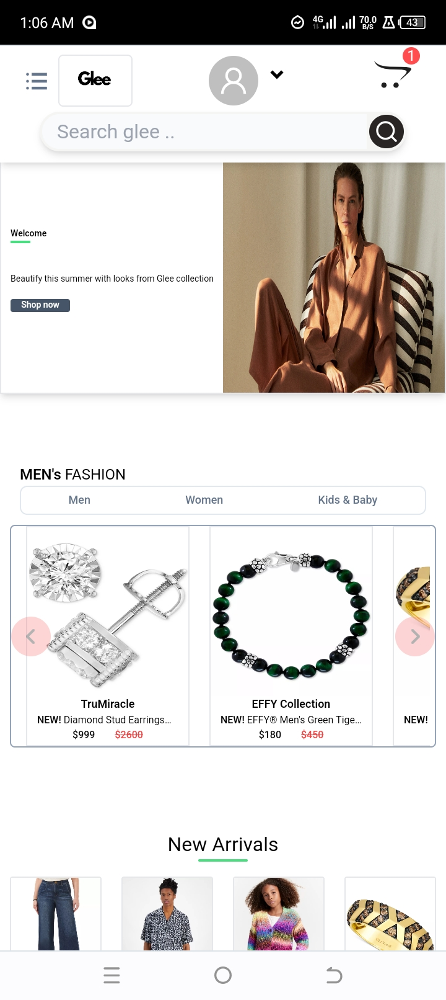
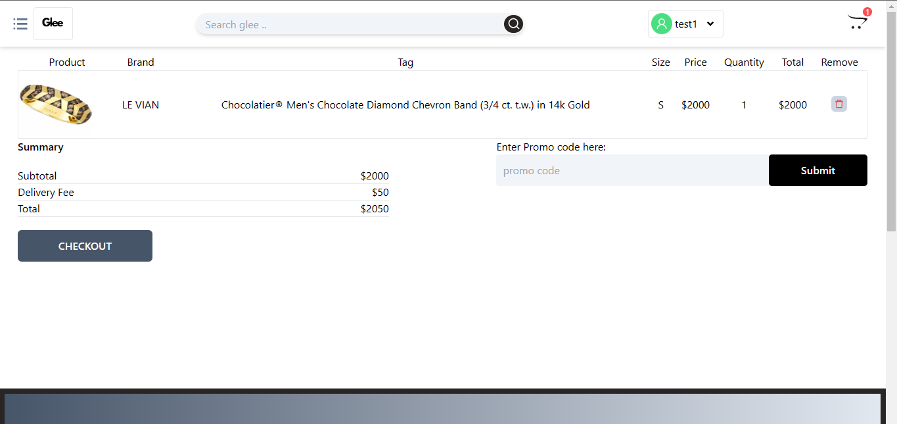
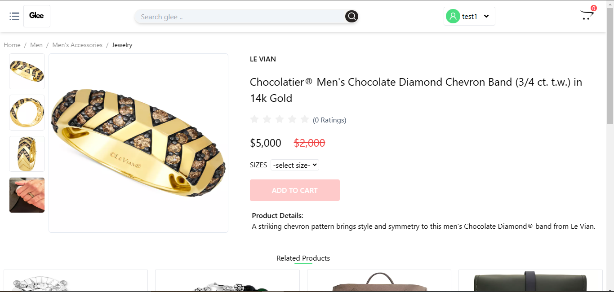
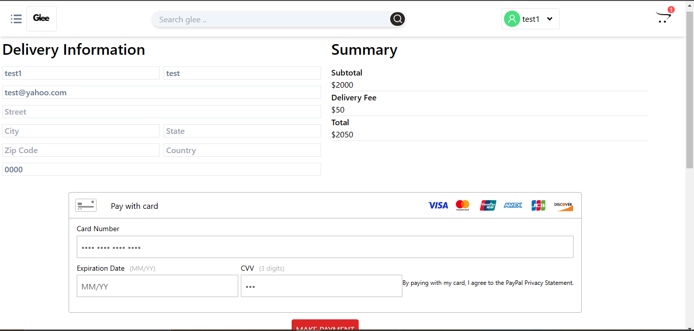
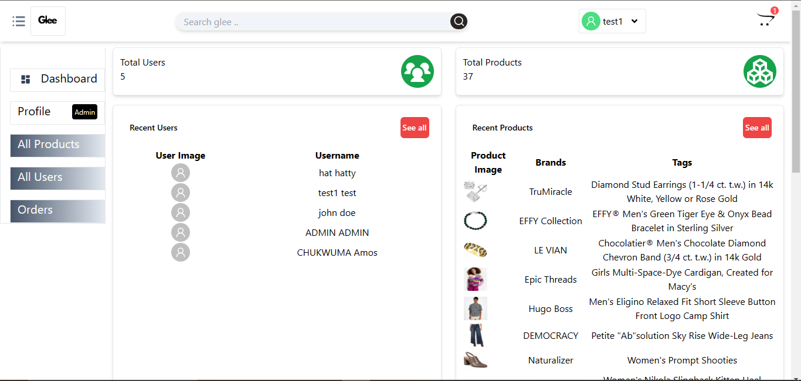

# INTRODUCTION TO GLEE-FASHION STORE
Glee is a responsive fullstack e-commerce web application built using the MERN stack. This app offers a seamless shopping experience with robust features such as user authentication, product management, secure payment processing, and more. The purpose of this project is to showcase my fullstack skills using MERN stack.

- [Features](#features)
- [Technologies Used](#technologies-used)
- [Installation](#installation)
- [Usage](#usage)
- [Contributing](#contributing)
- [Contact](#contact)

## Features

- User authentication and authorization (JWT)
- Product management (CRUD operations)
- File uploads using Multer
- Email notifications using Nodemailer
- State management with Redux and Redux Toolkit
- Persistent state with Redux Persist
- Responsive design with Ant Design (antd)
- API requests with Axios
- Environment variables with dotenv
- CORS enabled

## Technologies Used

### Frontend

- **React**: Library for building user interfaces
- **Redux & Redux Toolkit**: State management
- **Redux Persist**: Persistent state across sessions
- **Axios**: Promise-based HTTP client
- **Ant Design (antd)**: Design system for creating modern interfaces
- **React Icons**: Icons for React applications
- **React Router DOM**: Declarative routing
- **React Helmet**: Document head management
- **React Toastify**: Toast notifications
- **Braintree Web Drop-In React**: Secure payment integration
- **Moment.js**: Date manipulation
- **JS-Cookie**: Cookie manipulation
- **React Cookie**: React hooks for cookies
- **React Loading**: Loading indicators
- **Testing Library**: Testing utilities

### Backend

- **Node.js**: JavaScript runtime
- **Express**: Web framework for Node.js
- **MongoDB**: NoSQL database
- **Mongoose**: MongoDB object modeling
- **Multer**: Middleware for handling multipart/form-data
- **Nodemailer**: Email sending service
- **JWT**: JSON Web Tokens for authentication
- **dotenv**: Environment variable management
- **CORS**: Cross-Origin Resource Sharing
- **Helmet**: Security headers middleware
- **Braintree**: Payment processing
- **Body-parser**: Parse incoming request bodies
- **Cookie-parser**: Parse cookies
- **Express Formidable**: Form parsing middleware
- **Morgan**: HTTP request logger
- **Nanoid**: Unique ID generator
- **Validator**: String validation and sanitization
- **Nodemon**: Development tool for auto-restarting Node.js server

### Development Tools

- Concurrently (for running frontend and backend simultaneously)

## Installation

### Prerequisites

- Node.js and npm installed
- MongoDB database

### Clone the Repository

```bash
git clone https://github.com/CHIBUZOR-1/Glee-Fashionx.git
cd glee-store
```
## UI Snapshots

### Hompage


### Mobile Homepage


### Cart Page


### Product Page


### Checkout Page


### Admin Dashboard Page



### Frontend
```bash
$ cd frontend # go to client folder
$ npm install # install packages
$ npm start # run the client side statically with react-scripts
```

### Backend
start the server

```bash
$ cd SERVERSIDE # go to the server folder
$ npm install # install all packages
$ npm run server # start the server
```
## Environment variables
The following variables are required to run the program in the SERVERSIDE directory.
```bash
lOCALHOST=Port_number
JWT_SECRET=your_jwt_secret
MONGOOSE_URL=your_mongoose_url
URL=your_backend_url
EMAIL=your_email_for_nodemailer
PASSWORD=email_password
SECURE=false_for_development_and_true_for_production
PORTZ=port_used_for_nodemailer
HOST=host_for_nodemailer_hosting_service
SERVICE=nodemailer_hosting_service
BRAINTREE_MERCHANTID=your_braintree_merchant_id
BRAINTREE_PUBLICKEY=your_braintree_public_key
BRAINTREE_PRIVATEKEY=your_braintree_private_key
```

## LOGIN ACCOUNTS

### For Admin:
Email: test1@yahoo.com
Password: 22dd22

### For User:
Email: hat@yahoo.com
Password: 225522


## Contact

If you have any questions, feedback, or would like to connect, feel free to reach out to me.

- **Name:** Chibuzor Henry Amaechi
- **Email:** amaechihenrychibuzor@gmail.com

Feel free to contact me through any of the channels above. I'm open to collaborations and discussions related to Flutter development or any other projects.

### Summary:
- **Project Description**: Clear description of Glee Store as a fashion e-commerce platform.
- **Features**: Detailed list of features.
- **Technologies Used**: Comprehensive list of both frontend and backend technologies.
- **Installation and Usage**: Clear instructions for setting up and running the application.
- **Contributing**: Guidelines for contributing to the project.
- **Contact Information**: Additional channels for connecting with you.